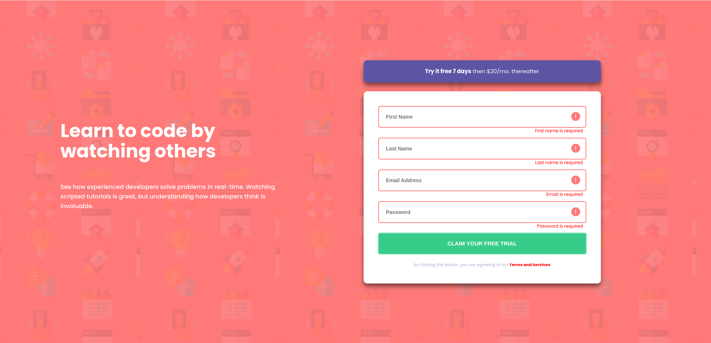

# Frontend Mentor - Intro Component with Sign Up Form Solution

This is a solution to the [Intro component with sign up form challenge on Frontend Mentor](https://www.frontendmentor.io/challenges/intro-component-with-signup-form-5cf91bd49edda32581d28fd1). Frontend Mentor challenges help you improve your coding skills by building realistic projects.

## Table of Contents

- [Overview](#overview)
  - [The Challenge](#the-challenge)
  - [Screenshot](#screenshot)
  - [Links](#links)
- [My Process](#my-process)
  - [Built With](#built-with)
  - [What I Learned](#what-i-learned)
  - [Continued Development](#continued-development)
  - [Useful Resources](#useful-resources)
- [Author](#author)

## Overview

### The Challenge

Users should be able to:

- View the optimal layout for the site depending on their device's screen size
- See hover states for all interactive elements on the page
- Receive an error message when the `form` is submitted if:
  - Any `input` field is empty. The message for this error should say *"[Field Name] cannot be empty"*
  - The email address is not formatted correctly (i.e., a correct email address should have this structure: `name@host.tld`). The message for this error should say *"Looks like this is not an email"*

### Screenshot

### Links

- Solution URL: [GitHub Repository](https://github.com/TedJenkler/Intro-component-with-sign-up-form-SCSS-Formik)
- Live Site URL: [Live Demo](https://signup-formik.netlify.app/)

## My Process

### Built With

- [Vite](https://vitejs.dev/) - A frontend build tool for fast development with a modern workflow.
- [SCSS](https://sass-lang.com/documentation) - For advanced styling and creating flexible, maintainable stylesheets.
- [Formik](https://formik.org/docs) - For managing form state and handling form validation in React applications.
- [Yup](https://github.com/jquense/yup) - For schema validation and error handling in forms, commonly used with Formik.

### What I Learned

During this project, I gained more experience in the following areas:

- **SCSS:** Realized that deeply nested SCSS can become difficult to manage. Moving forward, I'll aim to minimize nesting in larger components to maintain clarity and ease of maintenance.
- **Formik and Yup:** Learned to efficiently manage form state and validation using Formik and Yup, which streamlined the process of handling user input and error messages.

### Continued Development

- **Plan to further improve responsiveness**: Enhance the layout and design to ensure the application looks great on all devices, including tablets and small screens.
- **Add more details and improve animations**: Introduce additional visual elements and animations to enhance user experience and engagement.
- **Explore advanced form validation**: Integrate more sophisticated validation rules and error handling to ensure robust and user-friendly forms.

### Useful Resources

- [SCSS Documentation](https://sass-lang.com/documentation) - For comprehensive details on SCSS syntax and features.
- [Vite Documentation](https://vitejs.dev/) - For understanding and configuring Vite as a build tool and development server.
- [Formik Documentation](https://formik.org/docs) - For managing form state and handling form validation with ease in React applications.
- [Yup Documentation](https://github.com/jquense/yup) - For schema validation and error handling in forms, commonly used with Formik.

## Author

- Frontend Mentor - [@TedJenkler](https://www.frontendmentor.io/profile/TedJenkler)
- LinkedIn - [Teodor Jenkler](https://www.linkedin.com/in/tedjenklerwebdeveloper/)
- X - [@TJenkler](https://x.com/TJenkler)